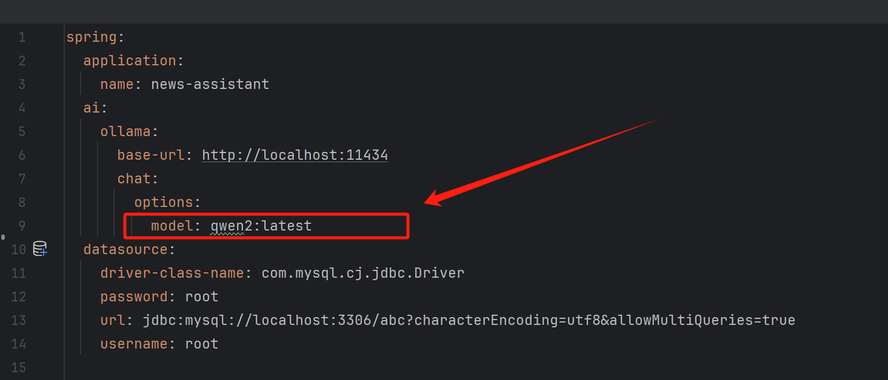

# AI新闻助手(AI-News-Assistant)

## 一、简介

基于 Java17 + Spring Ai + Ollama 的AI新闻助手,能够生成大模型简写概括后的新闻概要，并一键发送到各个平台（目前只对接了微信公众号）。

## 二、部署要求

1. Java17
2. Ollama
## 三、快速启动
1、下载项目代码

2、修改配置文件 application.yml 中的model

请求 ChatController.java 中的接口就能获得当日新闻了。

3、一键生成内容并发生送到微信公众号

需要要配置 application.yml 中微信公众号的参数

接口：WxOfficialAccountController.java 中的 /addDraft 

## 四、功能迭代

1、可以扩展更多发送的渠道，比如说自动发送到：邮箱、小红书...

2、可以扩展更多模型，目前只支持ollama的模型，Spring-Ai也封装好了很多模型，可以参考Spring-Ai的文档。

3、【重点】代码中如果有您觉得可以优化的地方，十分欢迎提issue和发起pr，一起交流学习才能写出更加优雅的代码！

### 个人
- 掘金：https://juejin.cn/user/3470537677866952
- 微信：xiaoyunt789 （+v的话可以稍微写下备注）
- 公众号：白海洋